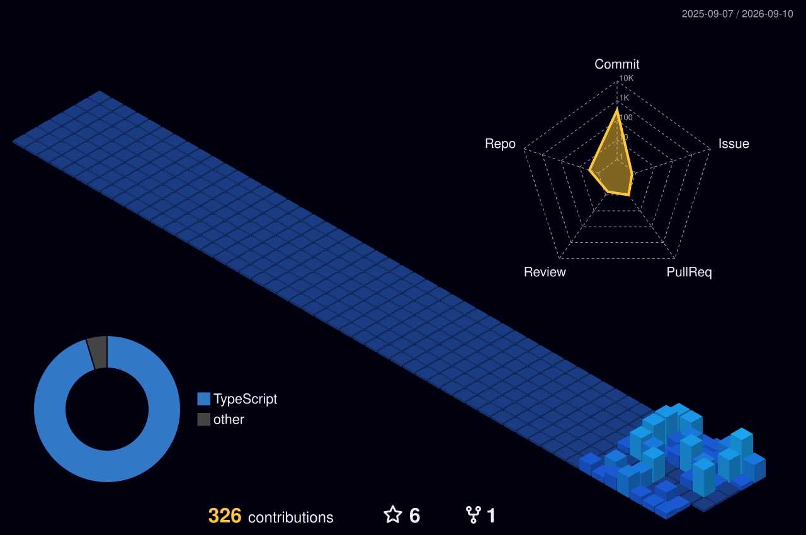

<!-- Header Banner -->

  

<!-- Typing SVG -->

  

---

### 🧑‍💻 About Me

- 🔭 I’m currently working on **[Your Current Project]**
- 🌱 I’m currently learning **[New Technology/Skill]**
- 👯 I’m looking to collaborate on **[Type of Projects]**
- 💬 Ask me about **[Your Expertise]**
- 📫 How to reach me: **[Your Email]**
- ⚡ Fun fact: **[Your Fun Fact]**

---

### 📊 3D Contribution Graph

<!-- This SVG is generated by the GitHub Action below -->

  

---

### 🛠️ Tech Stack

  
  
  
  
  
  

---

### 📈 GitHub Stats

  
  

  

---

### 🌐 Connect with Me

  
  
  

<!-- Footer Banner -->

  

